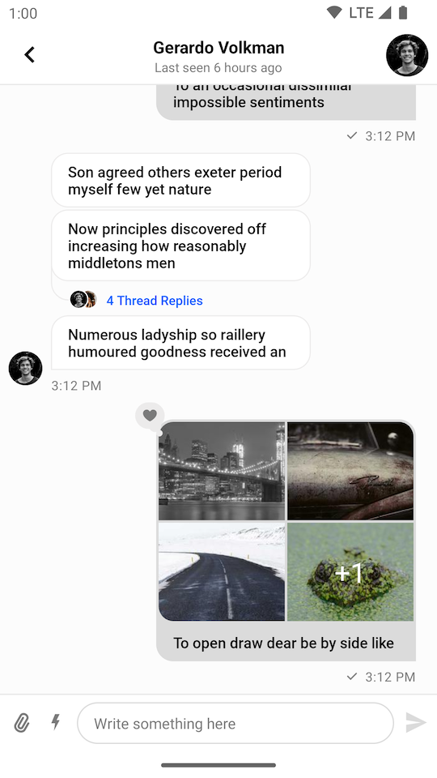
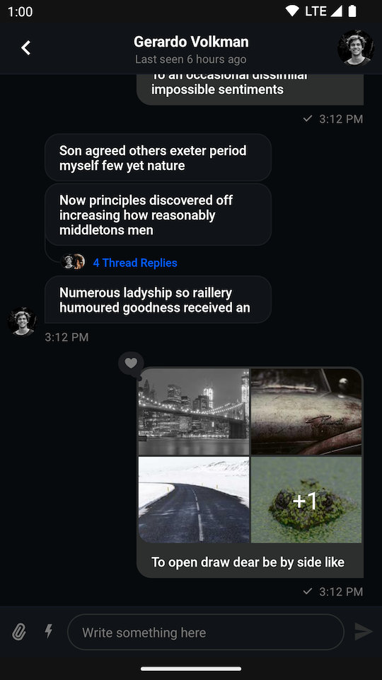

# Getting Started

The UI components library includes pre-built Android Views to easily load and display data from the Stream Chat API.

|||
| --- | --- |
|  |  |

This library builds on top of the offline library, and provides [ViewModels](#viewmodels) for each View to easily populate them with data and handle input events. The [sample app](#sample-app) showcases the UI components in action.

See the individual pages of the components to learn more about them:

- [Channel List](03-components/01-channel-list.md)
- [Channel List Header](03-components/02-channel-list-header.md)
- [Message List](03-components/03-message-list.md)
- [Message List Header](03-components/04-message-list-header.md)
- [Message Input](03-components/05-message-input.md)
- [Mention List View](03-components/06-mention-list-view.md)
- [Search View](03-components/07-search-view.md)
- [Attachment Gallery](03-components/08-attachment-gallery.md)

### ViewModels

Each UI component comes with its own ViewModel. These are used to easily connect them to `ChatDomain` to fetch data and perform actions.

These are Jetpack [ViewModels](https://developer.android.com/topic/libraries/architecture/viewmodel), so they allow the components to retain data across configuration changes. It's your responsibility to create these in the correct scope, usually in a Fragment or Activity.

For example, if you've added a `MessageListView` to your layout, you can create a corresponding ViewModel like this:

```kotlin
val factory: MessageListViewModelFactory = MessageListViewModelFactory(cid = "channelType:channelId") // 1
val messageListViewModel: MessageListViewModel by viewModels { factory } // 2
messageListViewModel.bindView(messageListView, viewLifecycleOwner) // 3
```

1. Create the ViewModel factory, providing any necessary parameters.
2. Fetch a ViewModel with Android ViewModel APIs, passing in the factory to be used.
3. Call the `bindView` method of the SDK to connect the View and ViewModel, passing in the appropriate `LifecycleOwner`.

`bindView` performs two-way binding: it sets up observers that push data from the ViewModel to the View, and sets up listeners that forward input events from the View to the ViewModel.

> If you're setting your own listeners on the Views, make sure to do it _after_ calling `bindView`.

You can learn more about setting up each UI component on its individual documentation page.

### Sample App

The [UI components sample app](https://github.com/GetStream/stream-chat-android/tree/main/stream-chat-android-ui-components-sample) is an open source, fully functional messaging application. It features threads, reactions, typing indicators, optimistic UI updates and offline storage. All built on top of our UI components.

|||
| --- | --- |
|  |  |

### Customization

The UI components offer customization options via XML attributes as well as instance methods. See the individual pages of the components for more details about this.

Components can also be customized globally, as described on the [Theming](04-guides/04-theming.md) page.

You can also use the [`ChatUI` object](02-chatui.md) to override such things as fonts, URL signing logic, etc.
