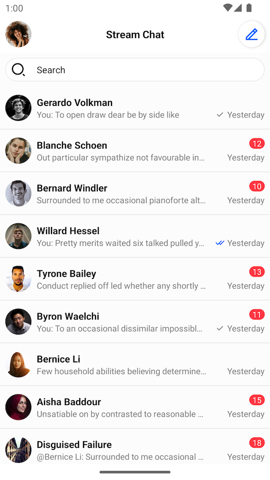
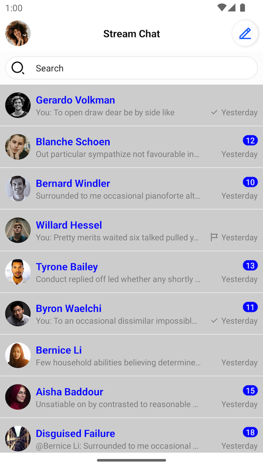

# Channel List

<!-- TODO: Import whatever makes sense to import from https://getstream.io/chat/docs/android/channel_list_view/?language=kotlin -->

## Overview

<!-- TODO: Brief description and a couple screenshots with default styling. -->

## Handling Actions

`ChannelListView` comes with a set of channel actions out of the box. Actions on `ChannelListView` items are available on swipe. You can:
* See channel members
* Delete the channel if you have sufficient permissions
* Leave the channel if it's a group channel

| Light Mode | Dark Mode |
| --- | --- |
|||

There are some actions that require additional handling:

```kotlin
channelListView.setChannelItemClickListener { channel ->
    // Handle Channel Click
}
channelListView.setChannelInfoClickListener { channel ->
    // Handle Channel Info Click
}
channelListView.setUserClickListener { user ->
    // Handle Member Click
}
```

The full list of available listeners is available [here](https://getstream.github.io/stream-chat-android/stream-chat-android-ui-components/stream-chat-android-ui-components/io.getstream.chat.android.ui.channel.list/-channel-list-view/index.html).

## Customization

### Customization with XML Attributes

<!-- TODO: Customization description -->

### Customization at Runtime

<!-- TODO: Review this example, possibly remove it. -->

Let's make an example and modify _ChannelListViewStyle_ programmatically. We want to change the title text appearance, some default icons, and colors, and disable some options:

| Before | After |
| --- | --- |
|||

In order to achieve such effect we need to provide custom _TransformStyle.channelListStyleTransformer_:
```kotlin
TransformStyle.channelListStyleTransformer = StyleTransformer { defaultStyle ->
    defaultStyle.copy(
        optionsEnabled = false,
        foregroundLayoutColor = Color.LTGRAY,
        indicatorReadIcon = ContextCompat.getDrawable(requireContext(), R.drawable.stream_ui_ic_clock)!!,
        channelTitleText = TextStyle(
            color = Color.WHITE,
            size = resources.getDimensionPixelSize(R.dimen.stream_ui_text_large),
        ),
        lastMessageText = TextStyle(
            size = resources.getDimensionPixelSize(R.dimen.stream_ui_text_small),
        ),
        unreadMessageCounterBackgroundColor = Color.BLUE,
    )
}
```
> **NOTE**: The transformer should be set before the view is rendered to make sure that the new style was applied.

## Creating a Custom ViewHolder Factory

`ChannelListView` provides a mechanism for completely changing the default view holders, as well as introducing different types of views. All you need to do is to provide your own `ChannelListItemViewHolderFactory`. Let's make an example that displays the channel's photo, name, and member count:


In order to achieve such effect, we need to do the following steps. We are going to use _View Binding_ to simplify things:

1. Create `custom_channel_list_item.xml` layout:

```xml
<?xml version="1.0" encoding="utf-8"?>
<androidx.constraintlayout.widget.ConstraintLayout xmlns:android="http://schemas.android.com/apk/res/android"
    xmlns:app="http://schemas.android.com/apk/res-auto"
    android:layout_width="match_parent"
    android:layout_height="64dp"
    >

    <io.getstream.chat.android.ui.avatar.AvatarView
        android:id="@+id/avatarView"
        style="@style/StreamUiChannelListAvatarStyle"
        android:layout_marginVertical="12dp"
        android:layout_marginStart="8dp"
        app:layout_constraintBottom_toBottomOf="parent"
        app:layout_constraintStart_toStartOf="parent"
        app:layout_constraintTop_toTopOf="parent"
        />

    <TextView
        android:id="@+id/nameTextView"
        android:layout_width="wrap_content"
        android:layout_height="wrap_content"
        android:layout_marginStart="8dp"
        android:ellipsize="end"
        android:singleLine="true"
        android:textAppearance="@style/StreamUiTextAppearance.BodyBold"
        app:layout_constraintBottom_toBottomOf="parent"
        app:layout_constraintEnd_toStartOf="@id/membersCountTextView"
        app:layout_constraintHorizontal_chainStyle="spread_inside"
        app:layout_constraintStart_toEndOf="@+id/avatarView"
        app:layout_constraintTop_toTopOf="parent"
        />

    <TextView
        android:id="@+id/membersCountTextView"
        android:layout_width="wrap_content"
        android:layout_height="wrap_content"
        android:layout_marginHorizontal="8dp"
        android:textAllCaps="false"
        android:textColor="#7A7A7A"
        android:textSize="14sp"
        android:textStyle="normal"
        app:layout_constraintBottom_toBottomOf="parent"
        app:layout_constraintEnd_toEndOf="parent"
        app:layout_constraintStart_toEndOf="@id/nameTextView"
        app:layout_constraintTop_toTopOf="parent"
        />

</androidx.constraintlayout.widget.ConstraintLayout>
```

2. Add _plurals_ entry to `strings.xml`

```xml
    <plurals name="members_count">
        <item quantity="one">%1d Member</item>
        <item quantity="other">%1d Members</item>
    </plurals>
```

3. Create custom view holder and view holder factory

```kotlin
    class CustomChannelListItemViewHolderFactory : ChannelListItemViewHolderFactory() {
        override fun createChannelViewHolder(parentView: ViewGroup): BaseChannelListItemViewHolder {
            return CustomChannelViewHolder(parentView, listenerContainer.channelClickListener)
        }
    }

    class CustomChannelViewHolder(
        parent: ViewGroup,
        private val channelClickListener: ChannelListView.ChannelClickListener,
        private val binding: CustomChannelListItemBinding = CustomChannelListItemBinding.inflate(
            LayoutInflater.from(parent.context),
            parent,
            false
        ),
    ) : BaseChannelListItemViewHolder(binding.root) {

        private lateinit var channel: Channel

        init {
            binding.root.setOnClickListener { channelClickListener.onClick(channel) }
        }

        override fun bind(channel: Channel, diff: ChannelListPayloadDiff) {
            this.channel = channel

            binding.apply {
                avatarView.setChannelData(channel)
                nameTextView.text = channel.getDisplayName(itemView.context)
                membersCountTextView.text = itemView.context.resources.getQuantityString(
                    R.plurals.members_count,
                    channel.members.size,
                    channel.members.size
                )
            }
        }
    }
```

4. Set custom view holder factory

```kotlin
channelListView.setViewHolderFactory(CustomChannelListItemViewHolderFactory())
```

## Creating a Custom Loading View

Let's see an example of `ChannelListView` that will have a custom loading view with a shimmer effect:

<!-- TODO: Actually show shimmer effect here in the screenshots. -->

| Light Mode | Dark Mode |
| --- | --- |
|||

Assuming that we have the setup similar to previous steps, we have to do the following steps:
1. Add Shimmer dependency
```groovy
implementation "com.facebook.shimmer:shimmer:0.5.0"
```
2. Add `shape_shimmer.xml` into _drawable_ folder:
```xml
<?xml version="1.0" encoding="utf-8"?>
<shape xmlns:android="http://schemas.android.com/apk/res/android"
    android:shape="rectangle"
    >
    <solid android:color="#CCCCCC" />
    <corners android:radius="20dp" />
</shape>
```
3. Add a single row layout - `item_loading_view.xml` into _layout_ folder:
```xml
<?xml version="1.0" encoding="utf-8"?>
<androidx.constraintlayout.widget.ConstraintLayout xmlns:android="http://schemas.android.com/apk/res/android"
    xmlns:app="http://schemas.android.com/apk/res-auto"
    android:layout_width="match_parent"
    android:layout_height="64dp"
    >

    <View
        android:id="@+id/avatarPlaceholder"
        android:layout_width="40dp"
        android:layout_height="40dp"
        android:layout_marginStart="8dp"
        android:background="@drawable/shape_shimmer"
        app:layout_constraintBottom_toBottomOf="parent"
        app:layout_constraintStart_toStartOf="parent"
        app:layout_constraintTop_toTopOf="parent"
        />

    <View
        android:id="@+id/titlePlaceholder"
        android:layout_width="80dp"
        android:layout_height="16dp"
        android:layout_gravity="center"
        android:layout_marginStart="8dp"
        android:layout_marginEnd="8dp"
        android:background="@drawable/shape_shimmer"
        app:layout_constraintStart_toEndOf="@id/avatarPlaceholder"
        app:layout_constraintTop_toTopOf="@id/avatarPlaceholder"
        />

    <View
        android:id="@+id/subtitlePlaceholder"
        android:layout_width="0dp"
        android:layout_height="16dp"
        android:layout_gravity="center"
        android:layout_marginStart="8dp"
        android:layout_marginTop="8dp"
        android:background="@drawable/shape_shimmer"
        app:layout_constraintBottom_toBottomOf="@id/avatarPlaceholder"
        app:layout_constraintEnd_toStartOf="@+id/datePlaceholder"
        app:layout_constraintStart_toEndOf="@id/avatarPlaceholder"
        />

    <View
        android:id="@+id/datePlaceholder"
        android:layout_width="40dp"
        android:layout_height="16dp"
        android:layout_gravity="center"
        android:layout_marginStart="16dp"
        android:layout_marginEnd="8dp"
        android:background="@drawable/shape_shimmer"
        app:layout_constraintEnd_toEndOf="parent"
        app:layout_constraintStart_toEndOf="@id/subtitlePlaceholder"
        app:layout_constraintTop_toTopOf="@id/subtitlePlaceholder"
        />

    <View
        android:id="@+id/separator"
        android:layout_width="0dp"
        android:layout_height="1dp"
        android:layout_gravity="center"
        android:background="@drawable/shape_shimmer"
        app:layout_constraintBottom_toBottomOf="parent"
        app:layout_constraintEnd_toEndOf="parent"
        app:layout_constraintStart_toStartOf="parent"
        />

</androidx.constraintlayout.widget.ConstraintLayout>
```
4. Create final loading view with shimmer effect. Let's call it `channel_list_loading_view`:
```xml
<?xml version="1.0" encoding="utf-8"?>
<com.facebook.shimmer.ShimmerFrameLayout xmlns:android="http://schemas.android.com/apk/res/android"
    xmlns:app="http://schemas.android.com/apk/res-auto"
    android:id="@+id/loadingViewContainer"
    android:layout_width="match_parent"
    android:layout_height="match_parent"
    android:layout_marginTop="64dp"
    app:shimmer_auto_start="true"
    app:shimmer_base_color="#CCCCCC"
    app:shimmer_colored="true"
    app:shimmer_highlight_color="#FFFFFF"
    >

    <LinearLayout
        android:layout_width="match_parent"
        android:layout_height="match_parent"
        android:orientation="vertical"
        >

        <include layout="@layout/item_loading_view" />

        <include layout="@layout/item_loading_view" />

        <include layout="@layout/item_loading_view" />

        <include layout="@layout/item_loading_view" />

        <include layout="@layout/item_loading_view" />

        <include layout="@layout/item_loading_view" />

    </LinearLayout>

</com.facebook.shimmer.ShimmerFrameLayout>
```

5. Change `ChannelListView`'s loading view:
```kotlin
// Inflate loading view
val loadingView = LayoutInflater.from(context).inflate(R.layout.channel_list_loading_view, channelListView)
// Set loading view
channelListView.setLoadingView(loadingView, FrameLayout.LayoutParams(MATCH_PARENT, MATCH_PARENT))
```
