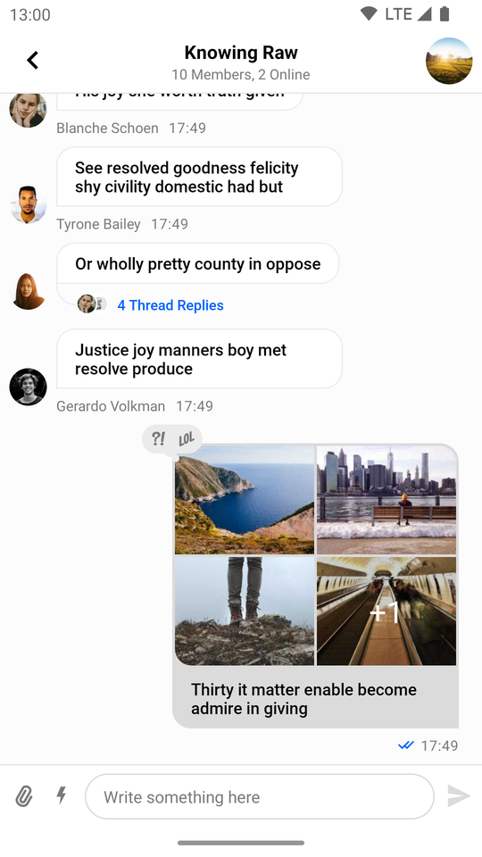
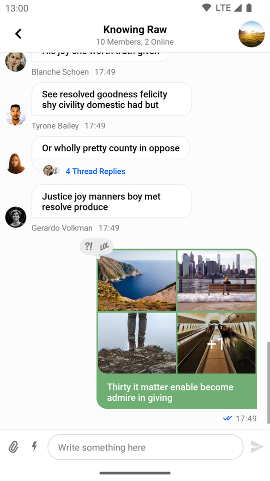
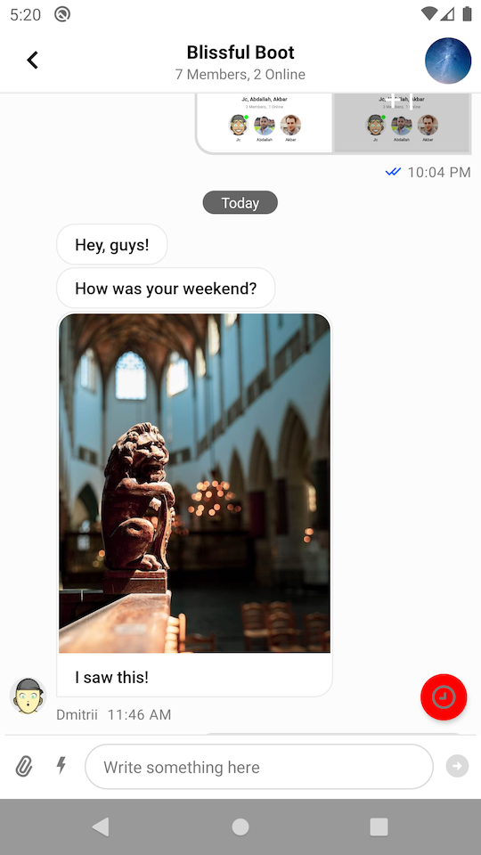

# Message List

`MessageListView` is one of our core UI components. Generally speaking, it's a list of messages for some particular channel. The `MessageListView` contains the following list of possible child items:

- Plain text message
- Text and attachments (media or file) message
- Deleted message (only for current user)
- Error message (e.g. autoblocked message with inappropriate content)
- System message (e.g. some user joined to a channel)
- Giphy preview
- Date separator
- Loading more indicator
- Thread separator (for thread mode only)
- Typing indicator

Using custom attributes and methods in runtime you're able to customize the appearance of this component. Also `MessageListView` contains the set of overridable action/option handlers and event listeners. By default this component has the following look:

| Light Mode | Dark Mode |
| --- | --- |
|||

## Usage
If you want to use all default features and default design of this component then start is easy. It consists of two steps:
1. Adding component to your xml layout hierarchy
2. Bind out-of-box `MessageListViewModel` and `MessageLisView`.

### Adding to xml layout
Adding `MessageListView` to your layout is easy as inserting following lines to your layout hierarchy (example for `ConstraintLayout`):

```xml
<io.getstream.chat.android.ui.message.list.MessageListView
        android:id="@+id/message_list_view"
        android:layout_width="0dp"
        android:layout_height="0dp"
        app:layout_constraintBottom_toBottomOf="parent"
        app:layout_constraintLeft_toLeftOf="parent"
        app:layout_constraintRight_toRightOf="parent"
        app:layout_constraintTop_toTopOf="parent"
        />
``` 

### ViewModel and binding
UI components provide out-of-box a view model for `MessageListView` and the `bindView` extension function that makes default setup:

```kotlin
class MessageListFragment : Fragment() {

    private lateinit var messageListView: MessageListView

    fun bindView() {
        val channelCID = "messaging:123"
        val viewModel = MessageListViewModel(cid = channelCID)
        viewModel.bindView(messageListView, this)
    }
}
``` 

## Handling Actions

`MessageListView` comes with a set of actions available out of the box by long-pressing a message:

* Adding reaction
* Replies
* Thread replies
* Copy message
* Edit message (if you are an owner)
* Delete message (if you are an owner)
* Flag message (if it doesn't belong to you)
* Mute user who sends a message (if it doesn't belong to you)
* Block user who sends a message (if it doesn't belong to you)

| Light Mode | Dark Mode |
| --- | --- |
|||

If you're not going to use out of the box `MessageListViewModel` with it's handlers or just want to override action handlers you should define these handlers:
```kotlin
fun setActionHandlers() {
        messageListView.setLastMessageReadHandler {
            // Handle when last message got read
        }
        messageListView.setEndRegionReachedHandler {
            // Handle when end region reached
        }
        messageListView.setMessageDeleteHandler { message: Message ->
            // Handle when message is going to be deleted
        }
        messageListView.setThreadStartHandler { message: Message ->
            // Handle when new thread for message is started
        }
        messageListView.setMessageFlagHandler { message: Message ->
           // Handle when message is going to be flagged
        }
        messageListView.setGiphySendHandler { message: Message, giphyAction: GiphyAction ->
            // Handle when some giphyAction is going to be performed
        }
        messageListView.setMessageRetryHandler { message: Message ->
            // Handle when some failed message is going to be retried
        }
        messageListView.setMessageReactionHandler { message: Message, reactionType: String ->
            // Handle when some reaction for message is going to be send
        }
        messageListView.setUserMuteHandler { user: User ->
            // Handle when a user is going to be muted
        }
        messageListView.setUserUnmuteHandler { user: User ->
            // Handle when a user is going to be unmuted
        }
        messageListView.setUserBlockHandler { user: User, cid: String ->
            // Handle when a user is going to be blocked in the channel with cid
        }
        messageListView.setMessageReplyHandler { cid: String, message: Message ->
            // Handle when message is going to be replied in the channel with cid
        }
        messageListView.setAttachmentDownloadHandler { attachment: Attachment ->
            // Handle when attachment is going to be downloaded
        }
    }
``` 

---
**NOTE**

Handlers must be set before passing any data to `MessageListView`. So if you don't use default binding, please, make sure you defined them.

___

### Listeners

Except of required handlers there are some listeners. They are set by default if you use `MessageListViewModel`.  
You can always override them to get events when something happens:

```kotlin
fun setListeners() {
        messageListView.setMessageClickListener { message: Message ->
            // Listen to click on message events
        }
        messageListView.setEnterThreadListener { message: Message ->
            // Listen to events when enter thread associated with a message
        }
        messageListView.setAttachmentDownloadClickListener { attachment: Attachment ->
            // Listen to events when download click for an attachment happens
        }
    }
```
Other available listeners for `MessageListView` can be found [here](https://getstream.github.io/stream-chat-android/stream-chat-android-ui-components/stream-chat-android-ui-components/io.getstream.chat.android.ui.message.list.adapter/-message-list-listener-container/index.html)

## Customizations

If you want to setup appearance of this component by your design requirements you're free to do it.
There are two ways to change the style: using XML attributes and runtime changes.

### Customization with XML Attributes
`MessageListView` provides a quite big set of xml attributes available for customization. The full list of them is available [here](https://github.com/GetStream/stream-chat-android/blob/main/stream-chat-android-ui-components/src/main/res/values/attrs_message_list_view.xml)
Let's consider an example when we want to change the style of messages sent by the current user.

| Light Mode | Dark Mode |
| --- | --- |
|||

In order to do that, we need to add additional attributes to `MessageListView`:
```xml
    <io.getstream.chat.android.ui.message.list.MessageListView
        android:id="@+id/messageListView"
        android:layout_width="0dp"
        android:layout_height="0dp"
        android:layout_marginHorizontal="0dp"
        android:clipToPadding="false"
        app:layout_constraintBottom_toTopOf="@+id/messageInputView"
        app:layout_constraintEnd_toEndOf="parent"
        app:layout_constraintStart_toStartOf="parent"
        app:layout_constraintTop_toBottomOf="@+id/messagesHeaderView"
        app:streamUiMessageBackgroundColorMine="#70AF74"
        app:streamUiMessageBackgroundColorTheirs="#FFFFFF"
        app:streamUiMessageTextColorMine="#FFFFFF"
        app:streamUiMessageTextColorTheirs="#000000"
        />
```

### Customization at Runtime

Both `MessageListView` and its ViewHolders can be configured programmatically (a list of supported customizations can be found [here](https://getstream.github.io/stream-chat-android/stream-chat-android-ui-components/stream-chat-android-ui-components/io.getstream.chat.android.ui.message.list/-message-list-view-style/index.html) and [here](https://getstream.github.io/stream-chat-android/stream-chat-android-ui-components/stream-chat-android-ui-components/io.getstream.chat.android.ui.message.list/-message-list-item-style/index.html)).

As an example, let's apply the green style from the previous section, but this time programmatically:

| Before | After |
| --- | --- |
|||

We are going to use custom _TransformStyle.messageListItemStyleTransformer_:
```kotlin
TransformStyle.messageListItemStyleTransformer = StyleTransformer { defaultViewStyle ->
    defaultViewStyle.copy(
        messageBackgroundColorMine = Color.parseColor("#70AF74"),
        messageBackgroundColorTheirs = Color.WHITE,
        textStyleMine = defaultViewStyle.textStyleMine.copy(color = Color.WHITE),
        textStyleTheirs = defaultViewStyle.textStyleTheirs.copy(color = Color.BLACK),
    )
}
```
___
**Note**

The transformers should be set before the views are rendered to make sure that the new style was applied.
___

As another example, let's modify the default view which allows scrolling to the bottom when the new message arrives:

| Before | After |
| --- | --- |
|||

To achieve such effect we need to provide custom _TransformStyle.messageListStyleTransformer_:
```kotlin
TransformStyle.messageListStyleTransformer = StyleTransformer { defaultViewStyle ->
    defaultViewStyle.copy(
        scrollButtonViewStyle = defaultViewStyle.scrollButtonViewStyle.copy(
            scrollButtonColor = Color.RED,
            scrollButtonUnreadEnabled = false,
            scrollButtonIcon = ContextCompat.getDrawable(requireContext(), R.drawable.stream_ui_ic_clock)!!,
        ),
    )
}
```

## Channel features flags

Some xml attributes provide possibility to enable/disable some features. They are:
- R.attrs.streamUiScrollButtonEnabled - defines show/hide the scroll to bottom button
- R.attrs.streamUiScrollButtonUnreadEnabled - defines show/hide unread count badge on the scroll to bottom button
- R.attrs.streamUiReactionsEnabled - defines if users can react to messages
- R.attrs.streamUiReplyEnabled - defines if users can reply to messages
- R.attrs.streamUiCopyMessageActionEnabled - defines if users can copy messages
- R.attrs.streamUiEditMessageEnabled - defines if users can edit their messages
- R.attrs.streamUiFlagMessageEnabled - defines if users can flag messages
- R.attrs.streamUiFlagMessageConfirmationEnabled - defines if users will see the confirmation dialog when flag messages
- R.attrs.streamUiMuteUserEnabled - defines if users can mute others
- R.attrs.streamUiBlockUserEnabled - defines if users can block members of chat
- R.attrs.streamUiDeleteMessageEnabled - defines if users can delete their messages
- R.attrs.streamUiDeleteConfirmationEnabled - defines if users will see the confirmation dialog when delete messages
- R.attrs.streamUiThreadsEnabled - defines if users can make thread reply

These attributes let you enable/disable configuration for channel features. E.g. if a channel supports message replies, but you disabled it via xml attributes then members of this channel won't see such an option.
`MessageListView` provides you the possibility to enable/disable these channel features in runtime.

```kotlin
fun disableChannelFeatures() {
        messageListView.setRepliesEnabled(false)
        messageListView.setDeleteMessageEnabled(false)
        messageListView.setEditMessageEnabled(false)
}
```
| Before | After |
| --- | --- |
|||

## Message list item factory
`MessageListItem` provides API for creating custom view holders. All you need to do is:
1. Extend  `MessageListItemViewHolderFactory`
2. Write your own logic for creating ViewHolders 
3. Make a new factory instance and set it to `MessageListView`.
Let's consider an example when we want to create custom view holders for messages that came from other users less than 24 hours ago.

Result should look like:


1. Add new layout `today_message_list_item.xml` for our custom view holder
``` xml
<?xml version="1.0" encoding="utf-8"?>
<androidx.constraintlayout.widget.ConstraintLayout
    xmlns:android="http://schemas.android.com/apk/res/android"
    xmlns:app="http://schemas.android.com/apk/res-auto"
    android:layout_width="match_parent"
    android:layout_height="wrap_content"
    >

    <com.google.android.material.card.MaterialCardView
        android:layout_width="wrap_content"
        android:layout_height="wrap_content"
        android:layout_marginTop="4dp"
        android:layout_marginStart="40dp"
        android:layout_marginBottom="4dp"
        app:cardBackgroundColor="@android:color/holo_green_dark"
        app:cardCornerRadius="8dp"
        app:cardElevation="0dp"
        app:layout_constraintHorizontal_bias="0"
        app:layout_constraintStart_toStartOf="parent"
        app:layout_constraintEnd_toEndOf="@id/marginEnd"
        app:layout_constraintTop_toTopOf="parent"
        >

        <TextView
            android:id="@+id/textLabel"
            android:layout_width="wrap_content"
            android:layout_height="wrap_content"
            android:gravity="center"
            android:textColor="@android:color/primary_text_light"
            android:padding="16dp"
            />

    </com.google.android.material.card.MaterialCardView>

    <androidx.constraintlayout.widget.Guideline
        android:id="@+id/marginEnd"
        android:layout_width="wrap_content"
        android:layout_height="wrap_content"
        android:orientation="vertical"
        app:layout_constraintGuide_percent="0.7"
        />

</androidx.constraintlayout.widget.ConstraintLayout>
```

2. Add new `TodayViewHolder` class to codebase
```kotlin
class TodayViewHolder(
    parentView: ViewGroup,
    private val binding: TodayMessageListItemBinding = TodayMessageListItemBinding.inflate(LayoutInflater.from(
        parentView.context),
        parentView,
        false),
) : BaseMessageItemViewHolder<MessageListItem.MessageItem>(binding.root) {

    override fun bindData(data: MessageListItem.MessageItem, diff: MessageListItemPayloadDiff?) {
        binding.textLabel.text = data.message.text
    }
}
```

3. Add new `CustomMessageViewHolderFactory` class to codebase
```kotlin
class CustomMessageViewHolderFactory : MessageListItemViewHolderFactory() {
    override fun getItemViewType(item: MessageListItem): Int {
        return if (item is MessageListItem.MessageItem &&
            item.isTheirs &&
            item.message.attachments.isEmpty() &&
            item.message.createdAt.isLessThenDayAgo()
        ) {
            TODAY_VIEW_HOLDER_TYPE
        } else {
            super.getItemViewType(item)
        }
    }

    private fun Date?.isLessThenDayAgo(): Boolean {
        if (this == null) {
            return false
        }
        val dayInMillis = TimeUnit.DAYS.toMillis(1)
        return time >= System.currentTimeMillis() - dayInMillis
    }

    override fun createViewHolder(
        parentView: ViewGroup,
        viewType: Int,
    ): BaseMessageItemViewHolder<out MessageListItem> {
        return if (viewType == TODAY_VIEW_HOLDER_TYPE) {
            TodayViewHolder(parentView)
        } else {
            super.createViewHolder(parentView, viewType)
        }
    }

    companion object {
        private const val TODAY_VIEW_HOLDER_TYPE = 1
    }
}
```

4. Finally, set instance of custom factory to `MessageListView`
```kotlin
fun setCustomViewHolderFactory() {
        messageListView.setMessageViewHolderFactory(CustomMessageViewHolderFactory())
    }
```

## Message list item predicate
If you want to filter some messages and don't show them in your `MessageListIem`.
Imagine you want not to show all messages that contain the "secret" word. It can be done with following lines:
```kotlin
fun setItemPredicate() {
        val forbiddenWord = "secret"
        val predicate = MessageListView.MessageListItemPredicate { item ->
            !(item is MessageListItem.MessageItem && item.message.text.contains(forbiddenWord))
        }
        messageListView.setMessageListItemPredicate(predicate)
    }
```

## Creating a Custom Empty State
`MessageListView` handles loading and empty states out-of-box. If you want to customize them you can do it in runtime.
Let's consider an example when you want to set a custom empty state.

```kotlin
fun setCustomEmptyView(context: Context) {
        val textView = TextView(context).apply {
            text = "There are no messages yet"
            setTextColor(Color.RED)
        }
        messageListView.setEmptyStateView(
            view = textView,
            layoutParams = FrameLayout.LayoutParams(
                FrameLayout.LayoutParams.WRAP_CONTENT,
                FrameLayout.LayoutParams.WRAP_CONTENT,
                Gravity.CENTER
            )
        )
    }
```

And you'll see such empty state:


