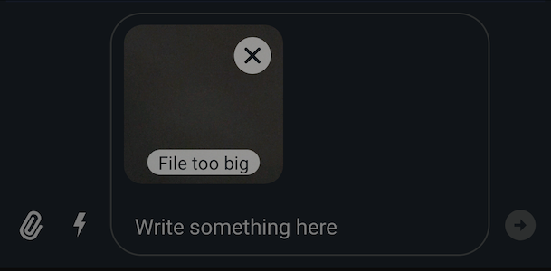

# Message Input

`MessageInputView` is the view used to create a new chat message. It is where the user will type new messages and send then to the chat, normally placed at the bottom of the chat screen:

|Light|Dark| 
|---|---|
|||

It supports the following features:

* Emoticons
* Attachments
* Slash Commands
* Typing events
* Editing messages
* Threads
* Mentions
* Replies

## Handling actions 

Many actions can be handle by setting listeners to this view, like a click in the send message button or a user start/stop typing:

```kotlin
messageInputView.setOnSendButtonClickListener {
    // Handle send button click
}

messageInputView.setTypingListener(
    object : MessageInputView.TypingListener {
        override fun onKeystroke() {
            // Handle keystroke case
        }

        override fun onStopTyping() {
            // Handle stop typing case
        }
    }
)
```

It is also possible to change the handler of messages so more customization is possible. 

```kotlin
messageInputView.setSendMessageHandler(
    object : MessageInputView.MessageSendHandler {
        override fun sendMessage(messageText: String, messageReplyTo: Message?) {
            // Handle send message
        }

        override fun sendMessageWithAttachments(
            message: String,
            attachmentsWithMimeTypes: List<Pair<File, String?>>,
            messageReplyTo: Message?,
        ) {
            // Handle message with attachments
        }

        override fun sendToThreadWithAttachments(
            parentMessage: Message,
            message: String,
            alsoSendToChannel: Boolean,
            attachmentsWithMimeTypes: List<Pair<File, String?>>,
        ) {
           // Handle message to thread with attachments
        }

        override fun sendToThread(parentMessage: Message, messageText: String, alsoSendToChannel: Boolean) {
            // Handle message to thread
        }

        override fun editMessage(oldMessage: Message, newMessageText: String) {
            // Handle edit message
        }

        override fun dismissReply() {
            // Handle dismiss reply
        }
    }
)
```

## ViewModel
To simplify the customization of behaviour for this view, it is possible to bind a `MessageInputViewModel` to it which will set the listeners and make it fully usable:

```kotlin
val factory: MessageListViewModelFactory = MessageListViewModelFactory(cid = "channelType:channelId")
val viewModel: MessageInputViewModel by viewModels { factory }
// Bind it with MessageInputView
viewModel.bindView(messageInputView, viewLifecycleOwner)
```

## Customizations

`MessageInputView` can be customized in two ways: Using XML and programmatically.

### Customization with XML Attributes

Many attributes of this View can be configured, like changing its color, the border and the color of the message input, fonts, components visibility, and so on. The full list of available attributes can be found [here](https://github.com/GetStream/stream-chat-android/blob/main/stream-chat-android-ui-components/src/main/res/values/attrs_message_input_view.xml).

Here's an example of setting some custom attributes:

```xml
<io.getstream.chat.android.ui.message.input.MessageInputView
    android:id="@+id/messageInputView"
    android:layout_width="0dp"
    android:layout_height="wrap_content"
    android:background="@color/grey_light"
    app:streamUiMessageInputEditTextBackgroundDrawable="@drawable/stream_ui_shape_edit_text_squared"
    app:streamUiMessageInputTextStyle="italic"
    app:streamUiMessageInputDividerBackgroundDrawable="@drawable/stream_ui_divider_green"
    app:streamUiMessageInputTextColor="@color/stream_ui_white"
    />
```

This will create this version of `MessageInputView`:


Here's another example with different attributes set:

```xml
<io.getstream.chat.android.ui.message.input.MessageInputView
    android:id="@+id/messageInputView"
    android:layout_width="0dp"
    android:layout_height="wrap_content"
    app:layout_constraintBottom_toBottomOf="parent"
    app:layout_constraintEnd_toEndOf="parent"
    app:layout_constraintStart_toStartOf="parent"
    app:layout_constraintTop_toBottomOf="@+id/messageListView"
    app:streamUiMessageInputEditTextBackgroundDrawable="@drawable/stream_ui_shape_edit_text_rounded"
    app:streamUiMessageInputTextStyle="italic"
    android:background="@color/stream_ui_black"
    app:streamUiMessageInputDividerBackgroundDrawable="@drawable/stream_ui_divider_green"
    app:streamUiMessageInputTextColor="@color/stream_ui_white"
    />
```

This produces the following styling:


Different configurations can be used to achieve the desired appearance of `MessageListView`. If you don't need to change this View appearance at runtime, XML should be enough. But if you need to able to customize it at runtime, then you can use `MessageInputViewStyle` as described in the next section.

### Customization at Runtime

Many views in this SDK can be configured by changing the configuration class inside [TransformStyle](https://github.com/GetStream/stream-chat-android/blob/develop/stream-chat-android-ui-components/src/main/kotlin/io/getstream/chat/android/ui/TransformStyle.kt).

Just change the instance of `messageInputStyleTransformer`. Example:

```kotlin
TransformStyle.messageInputStyleTransformer = StyleTransformer { viewStyle ->
    viewStyle.copy(
        messageInputTextColor = ContextCompat.getColor(requireContext(), R.color.stream_ui_white)
    )
}
```

Note: The transformer should be set before the View is rendered to make sure that the new style was applied.

### Customizing suggestion list popup items

The suggestion list popup is used to provide autocomplete suggestions for commands and mentions. To customize the appearance of suggestion list items you need to provide your own `SuggestionListViewHolderFactory`. Here's an example of a custom command item that displays just a command name:

1. Create `item_command.xml` layout:

```xml
<?xml version="1.0" encoding="utf-8"?>
<FrameLayout xmlns:android="http://schemas.android.com/apk/res/android"
    android:layout_width="match_parent"
    android:layout_height="wrap_content"
    android:background="?attr/selectableItemBackground"
    android:paddingStart="16dp"
    android:paddingEnd="16dp"
    android:paddingTop="8dp"
    android:paddingBottom="8dp">

    <TextView
        android:id="@+id/commandNameTextView"
        android:layout_width="wrap_content"
        android:layout_height="wrap_content" />

</FrameLayout>
```

2. Create custom view holder and view holder factory

```kotlin
class CustomSuggestionListViewHolderFactory : SuggestionListItemViewHolderFactory() {

    override fun createCommandViewHolder(
        parent: ViewGroup,
    ): BaseSuggestionItemViewHolder<SuggestionListItem.CommandItem> {
        return ItemCommandBinding
            .inflate(LayoutInflater.from(parent.context), parent, false)
            .let(::CustomCommandViewHolder)
    }
}

class CustomCommandViewHolder(
    private val binding: ItemCommandBinding,
) : BaseSuggestionItemViewHolder<SuggestionListItem.CommandItem>(binding.root) {

    override fun bindItem(item: SuggestionListItem.CommandItem) {
        binding.commandNameTextView.text = item.command.name
    }
}
```

4. Set custom view holder factory
```kotlin
messageInputView.setSuggestionListViewHolderFactory(CustomSuggestionListViewHolderFactory())
```

This produces the following result:


## Attributes
Apart of the attibutes mentioned in the [Customizations](#customizations) section, you can check all the attibutes available for `MessageInputView` [here](https://github.com/GetStream/stream-chat-android/blob/develop/stream-chat-android-ui-components/src/main/res/values/attrs_message_input_view.xml). 

## Attachments
There a limit for the size of attachments in this view. The default value is 20Mb, a file bigger than the limit that won't be allowed to be send and the user will be notified:



The max value of attachment can be changed with `MessageInputViewStyle.attachmentMaxFileSize`, but there's a limit in the backend of Stream that won't allow an attachment bigger than 20Mb. In order to work with attachments bigger than the limit, it is possible for a developer to use its own API and handle the attachments by using `MessageInputView.setSendMessageHandler`.

It is also possible to listen for big attachments added to the list of attachment to present a custom message to the user with `MessageInputView.listenForBigAttachments`. 
