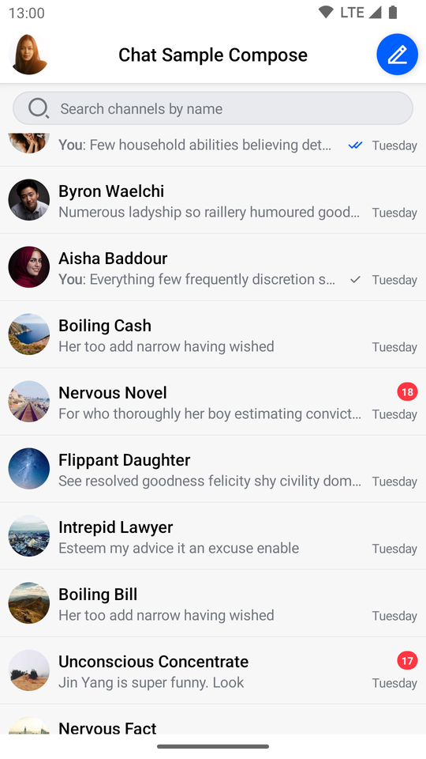

# Channel List Screen

The easiest way to set up a screen that shows the active user's channels and give them the ability to search for a specific channel is to use one of the following components:

* `ChannelListFragment`: A Fragment that represents a self-contained channel list screen.
* `ChannelListActivity`: An Activity that is just a thin wrapper around `ChannelListFragment`.

`ChannelListFragment` contains and initializes four components internally:

* [`ChannelListHeaderView`](./02-channel-list-header.md): Displays information about the current user and the connection state.
* [`ChannelListView`](./01-channel-list.md): Displays a list of channel items in a paginated list.
* [`SearchInputView`](./07-search-view.md): An input field to search for messages that contain specific text.
* [`SearchResultListView`](./07-search-view.md): Displays a list of search results.

**Note**: Fragments and Activities representing self-contained screens are easy to use. They allow you to explore the SDK's features in a breeze, however, they offer limited customization.

## Usage

To use channel list screen, you just need to add `ChannelListFragment` to your Activity or Fragment:

```kotlin
class MyChannelListActivity : AppCompatActivity() {

    override fun onCreate(savedInstanceState: Bundle?) {
        super.onCreate(savedInstanceState)
        setContentView(R.layout.stream_ui_fragment_container)

        if (savedInstanceState == null) {
            supportFragmentManager.beginTransaction()
                .replace(R.id.container, ChannelListFragment.newInstance())
                .commit()
        }
    }
}
```

Alternatively, you can simply start `ChannelListActivity` from the SDK to achieve similar result with a single line of code:

```kotlin
context.startActivity(ChannelListActivity.createIntent(context))
```

This small snippet will produce a fully working solution, as shown in the image below.



## Handling Actions

To handle actions supported by `ChannelListFragment` you have to implement corresponding click listeners in the parent Fragment or Activity:

```kotlin
class MyChannelListActivity : AppCompatActivity(), 
    ChannelListFragment.HeaderActionButtonClickListener,
    ChannelListFragment.HeaderUserAvatarClickListener, 
    ChannelListFragment.ChannelListItemClickListener,
    ChannelListFragment.SearchResultClickListener {
  
    override fun onCreate(savedInstanceState: Bundle?) {
        super.onCreate(savedInstanceState)
        // Add ChannelListFragment to the layout
    }

    override fun onUserAvatarClick() {
        // Handle header avatar click
    }

    override fun onActionButtonClick() {
        // Handle header action button click
    }

    override fun onChannelClick(channel: Channel) {
        // Handle channel click
    }

    override fun onSearchResultClick(message: Message) {
        // Handle search result click
    }
}
```

There are four main click listeners you can use with the `ChannelListFragment`:

* `HeaderActionButtonClickListener`: Click listener for the right button in the header. Not implemented by default.
* `HeaderUserAvatarClickListener`: Click listener for the left button in the header represented by the avatar of the current user. Not implemented by default.
* `ChannelListItemClickListener`: Click listener for channel item clicks. Navigates to `MessageListActivity` by default.
* `SearchResultClickListener`: Click listener for search result items. Navigates to `MessageListActivity` by default.

## Customization
