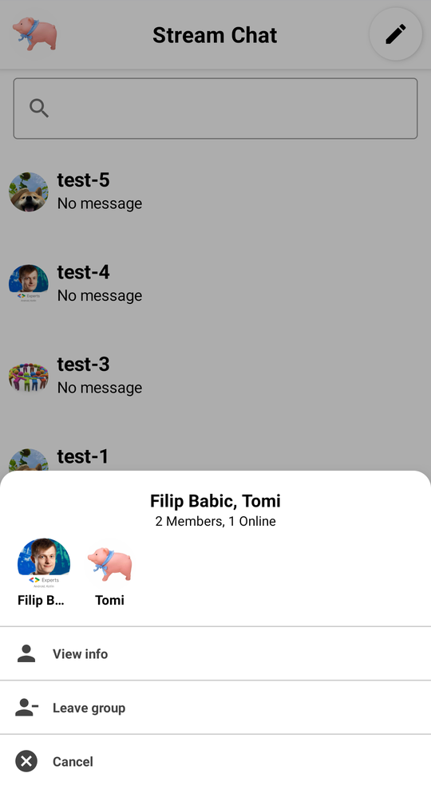

# ChannelsScreen

The easiest way to set up a screen that shows the active user's channels and give them the ability to search for a specific channel, is to use the `ChannelScreen`.

`ChannelScreen` sets up four components internally:

* `ChannelListHeader`: Shows the information of the current user and exposes a trailing action.
* `ChannelSearch`: Allows users to query channels by ID.
* `ChannelList`: The core part of the screen, which renders channels for the active user, based on defined filters.
* `ChannelsBottomDrawer`: A bottom drawer that is shown when long clicking on a `Channel` in the list.

It also sets up all the business logic and styles the UI according to our default design system. Next, you'll learn how to use it.

## Usage

To use the `ChannelsScreen`, you just need to call it within `setContent()` in your `Activity` or `Fragment`:

```kotlin
override fun onCreate(savedInstanceState: Bundle?) {
    super.onCreate(savedInstanceState)

    setContent {
        ChatTheme {
            ChannelsScreen()
        }
    }
}
```

:::note 

The `ChannelScreen` can be used without any parameters, but we advise that you pass in the title of your app, as well as the action handlers.

:::

This small snippet will produce a fully-working solution, as shown in the image below.

 

To get a better feel of the component, you'll want to customize its actions.

## Handling Actions

When it comes to action handlers exposed in the `ChannelScreen` signature you have access to the following:

```kotlin
fun ChannelsScreen(
	..., // filters and UI customization
    onHeaderClickAction: () -> Unit = {},
    onItemClick: (Channel) -> Unit = {},
    onViewChannelInfoAction: (Channel) -> Unit = {},
    onBackPressed: () -> Unit = {}
)
```

There are four main action handlers you can use with the `ChannelScreen`:

* `onHeaderClickAction`: Handler for the default header trailing icon click action.
* `onItemClick`: Handler when a `Channel` is clicked.
* `onViewChannelInfoAction`: Handler when the **View info** action is selected in `ChannelsBottomDrawer`. 
* `onBackPressed`: Handler when the system back button is clicked.

All of these actions are empty by default, but if you want to customize them, you can do the following:

```kotlin
override fun onCreate(savedInstanceState: Bundle?) {
    super.onCreate(savedInstanceState)

    setContent {
        ChatTheme {
            ChannelsScreen(
                onItemClick = ::openMessages,
                onHeaderClickAction = {
                    // handle the header click action
                },
                onBackPressed = { finish() },
                onViewChannelInfoAction = {
                    // show UI to view more channel info
                }
            )
        }
    }
}
```

These four parameters let you customize the behavior of the `ChannelScreen` to an extent, as you can react to the **Header Action Click**, **Back Pressed**, **Item Click** and **Channel Info** actions.

## Customization

`ChannelScreen` is one of our **out-of-box** solution components and as such it doesn't offer much customization. As with any component, you can customize the content theme and styling by wrapping it the `ChatTheme`.

When it comes to UI and behavior customization in the `ChannelScreen` signature, you have access to the following:

```kotlin
fun ChannelsScreen(
    filters: FilterObject = Filters.and(
        Filters.eq("type", "messaging"),
        Filters.`in`("members", listOf(ChatClient.instance().getCurrentUser()?.id ?: ""))
    ),
    querySort: QuerySort<Channel> = QuerySort.Companion.desc("id"),
    title: String = "Stream Chat",
    isShowingHeader: Boolean = true,
    isShowingSearch: Boolean = true,
    ... // action handlers
)
```

* `filters`: These filters are applied to the channel query, meaning you can customize what data to show in the list.
* `querySort`: Like with filters, these are applied to the list data and affect its sorting order.
* `title`: The title of the `ChannelListHeader`.
* `isShowingHeader`: Flag that affects if we show the `ChannelListHeader`. `true` by default.
* `isShowingSearch`: Flag that affects if we show the `SearchInput`. `true` by default.

If you want to build a custom Channels screen UI or override the default the behavior, follow our [Building Custom Screens](../08-guides/06-building-custom-screens.md) guide.
