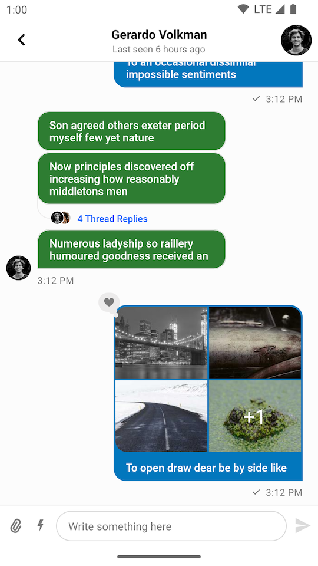

# Theming

Many parts of the UI components can be changed and customized. It is possible to change colors, fonts, sizes and many other aspects of the `Views` to match a desired look. It is possible to change:

- Font family
- Text color
- Background of view and internal views. (ex: Message inside MessageListView) 
- Enable and disable features.
- Text style (italic, bold, normal)
- Drawable of icons
- Stroke width some views.
- Divider color of views.
- Text of views.

It is not possible to change the tint of icons, it is necessary to change the Drawable if a different color is desired.

Views can be customized by two ways: `TransformStyle` object or by the attributes of the View in the XML, as described in the next section.

## Global Styling

Styles can be configured programmatically by overriding the corresponding `StyleTransformer` from the `TransformStyle` object.

:::caution
This doesn't apply the changes instantly, the view must be recreated for the changes to take effect.
:::

:::caution
Please keep in mind that using will `TransformStyle` overrides the configurations made using the attributes of the class. Don't use both ways are the same time as only `TransformStyle` will be applied.
:::

You can use `TransformStyle` to change many aspects of MessageListView

**TransformStyle**

```kotlin
TransformStyle.messageListItemStyleTransformer = StyleTransformer { defaultViewStyle ->
    defaultViewStyle.copy(
        messageBackgroundColorMine = Color.parseColor("#70AF74"),
        messageBackgroundColorTheirs = Color.WHITE,
        textStyleMine = defaultViewStyle.textStyleMine.copy(color = Color.WHITE),
        textStyleTheirs = defaultViewStyle.textStyleTheirs.copy(color = Color.BLACK),
    )
}
```

**XML**

```xml
<io.getstream.chat.android.ui.message.list.MessageListView
    android:id="@+id/messageListView"
    android:layout_width="match_parent"
    android:layout_height="match_parent"
    app:streamUiMessageBackgroundColorMine="#70AF74"
    app:streamUiMessageBackgroundColorTheirs="@android:color/white"
    app:streamUiMessageTextColorMine="@android:color/white"
    app:streamUiMessageTextColorTheirs="@android:color/black"
    />
```

Both will have the following result:



